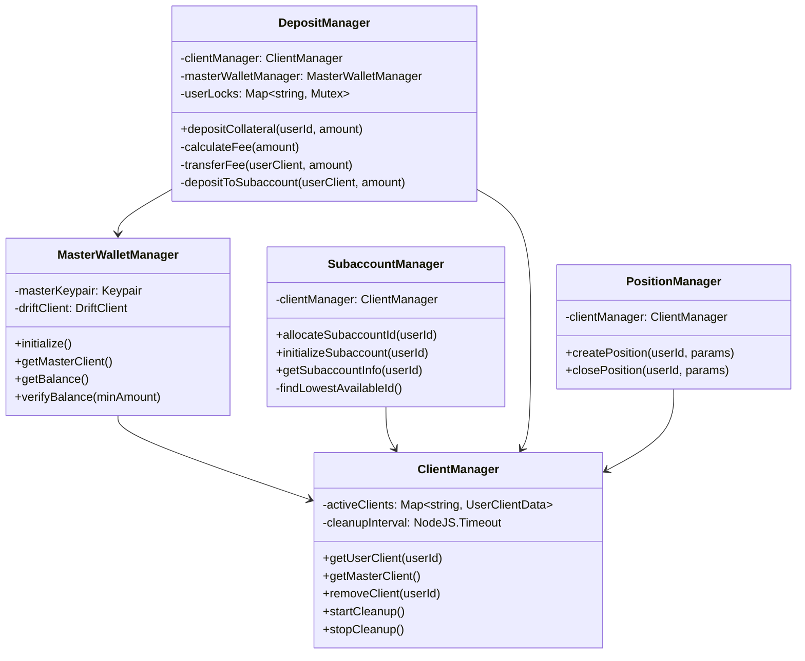
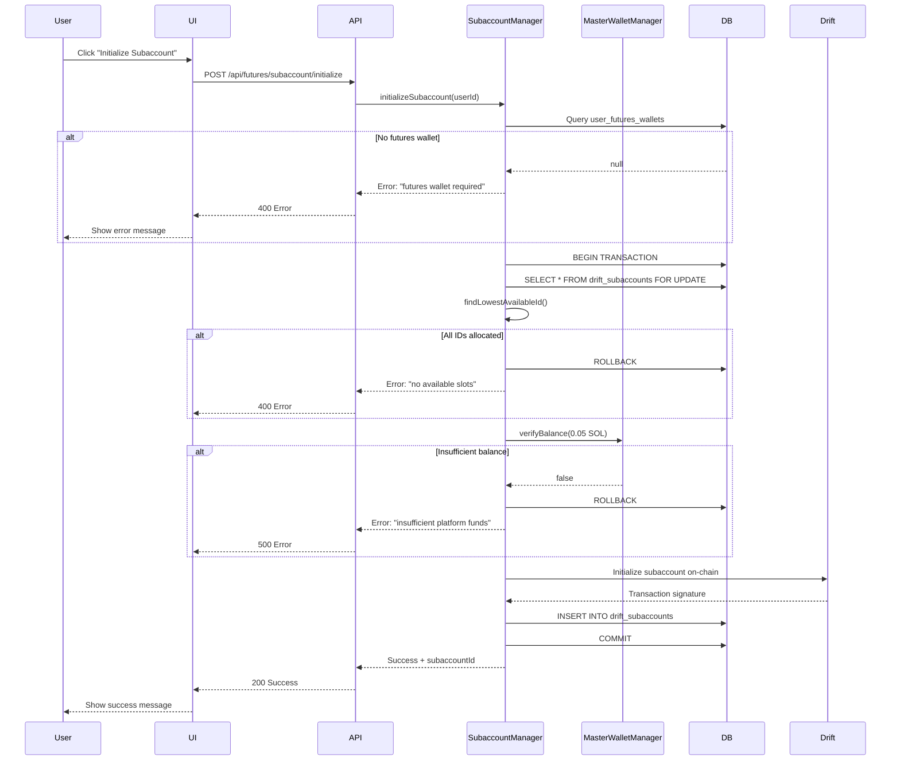
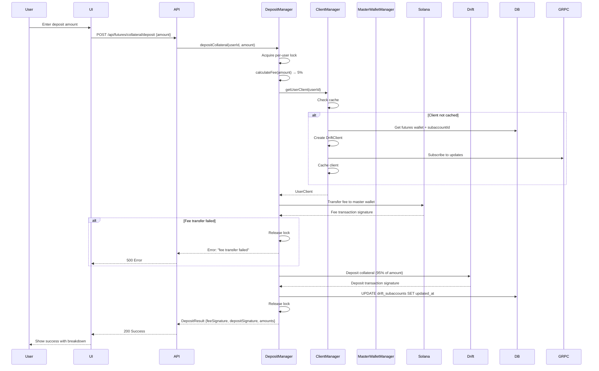
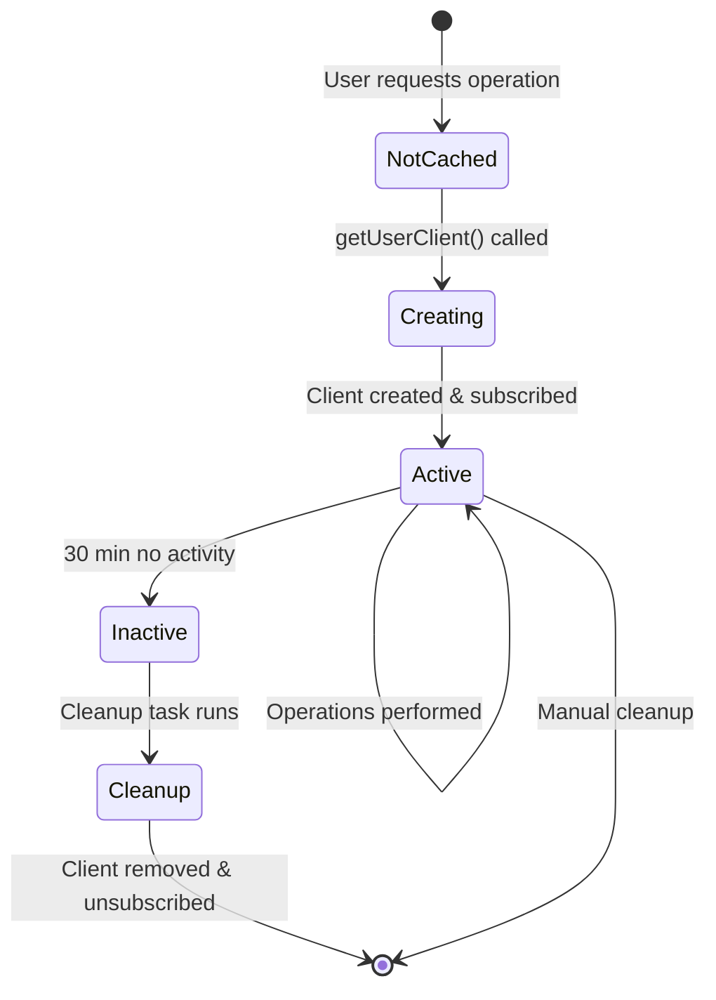

                                           # Design Document: Drift Master Wallet Subaccount System

## Overview

This document provides a comprehensive technical design for the Drift Protocol Master Wallet Subaccount System. The system manages a centralized master wallet for fee collection, allocates unique subaccount IDs (0-255) to users, handles collateral deposits with automatic 5% fee deduction, and provides a React context for frontend integration.

### System Goals

- Centralized fee collection through a master wallet
- Efficient subaccount ID allocation with race condition prevention
- Automatic fee deduction (5%) from all user deposits
- Concurrent deposit handling with per-user locking
- gRPC-based real-time data streaming (no WebSockets or polling)
- Secure server-side key management
- Seamless integration with existing DriftContext
 
### Key Design Principles

1. **Security First**: Private keys never exposed to frontend, encrypted at rest
2. **Concurrency Safe**: Per-user locks prevent race conditions
3. **Resource Efficient**: Client pooling and automatic cleanup
4. **Developer Friendly**: Type-safe APIs with clear error messages
5. **Backward Compatible**: Enhances existing DriftContext without breaking changes


## Architecture

### High-Level System Architecture

```mermaid
graph TB
    subgraph "Frontend Layer"
        UI[React Components]
        DC[DriftContext Provider]
    end
    
    subgraph "API Layer"
        API1[/api/futures/master/*]
        API2[/api/futures/subaccount/*]
        API3[/api/futures/collateral/*]
        API4[/api/futures/position/*]
    end
    
    subgraph "Service Layer"
        MWM[MasterWalletManager]
        SAM[SubaccountManager]
        DM[DepositManager]
        CM[ClientManager]
        PM[PositionManager]
    end
    
    subgraph "Data Layer"
        DB[(MongoDB)]
        CACHE[In-Memory Cache]
    end
    
    subgraph "External Services"
        DRIFT[Drift Protocol]
        GRPC[Yellowstone gRPC]
        SOL[Solana RPC]
    end
    
    UI --> DC
    DC --> API1
    DC --> API2
    DC --> API3
    DC --> API4
    
    API1 --> MWM
    API2 --> SAM
    API3 --> DM
    API4 --> PM
    
    MWM --> CM
    SAM --> CM
    DM --> CM
    PM --> CM
    
    CM --> DB
    CM --> CACHE
    
    CM --> DRIFT
    CM --> GRPC
    MWM --> SOL
    DM --> SOL
```

### Component Relationships




### Data Flow Diagrams

#### Subaccount Initialization Flow



#### Collateral Deposit with Fee Deduction Flow




#### Client Lifecycle and Cleanup Flow




## Components and Interfaces

### MasterWalletManager

**Responsibility**: Manages the platform's master wallet for fee collection and subaccount initialization costs.

**Interface**:

```typescript
interface MasterWalletManager {
  /**
   * Initialize the master wallet from environment or vault
   * @throws Error if master key not found or invalid
   */
  initialize(): Promise<void>;
  
  /**
   * Get the Drift client for the master wallet
   * @returns Configured DriftClient instance
   */
  getMasterClient(): DriftClient;
  
  /**
   * Get current SOL balance of master wallet
   * @returns Balance in SOL
   */
  getBalance(): Promise<number>;
  
  /**
   * Verify master wallet has sufficient balance
   * @param minAmount Minimum required balance in SOL
   * @returns true if balance >= minAmount
   */
  verifyBalance(minAmount: number): Promise<boolean>;
  
  /**
   * Get master wallet public address
   * @returns Solana public key as string
   */
  getAddress(): string;
}
```

**Implementation Details**:

```typescript
class MasterWalletManagerImpl implements MasterWalletManager {
  private masterKeypair: Keypair | null = null;
  private driftClient: DriftClient | null = null;
  private connection: Connection;
  
  constructor(rpcUrl: string) {
    this.connection = new Connection(rpcUrl);
  }
  
  async initialize(): Promise<void> {
    // 1. Try MASTER_KEY environment variable
    let privateKeyBase58 = process.env.MASTER_KEY;
    
    // 2. Fallback to secure vault (if configured)
    if (!privateKeyBase58 && process.env.VAULT_URL) {
      privateKeyBase58 = await this.loadFromVault();
    }
    
    // 3. Fail if no key found
    if (!privateKeyBase58) {
      throw new Error('Master key not found in environment or vault');
    }
    
    // 4. Create keypair and verify
    this.masterKeypair = Keypair.fromSecretKey(
      bs58.decode(privateKeyBase58)
    );
    
    // 5. Initialize Drift client
    this.driftClient = new DriftClient({
      connection: this.connection,
      wallet: new Wallet(this.masterKeypair),
      programID: DRIFT_PROGRAM_ID,
      accountSubscription: {
        type: 'grpc',
        grpcConfigs: [{
          endpoint: process.env.YELLOWSTONE_GRPC_ENDPOINT!,
          token: process.env.YELLOWSTONE_GRPC_TOKEN
        }]
      }
    });
    
    await this.driftClient.subscribe();
    
    // 6. Verify minimum balance
    const balance = await this.getBalance();
    if (balance < 0.1) {
      console.warn(`Master wallet balance low: ${balance} SOL`);
    }
    
    console.log(`Master wallet initialized: ${this.getAddress()}`);
  }
  
  getMasterClient(): DriftClient {
    if (!this.driftClient) {
      throw new Error('Master wallet not initialized');
    }
    return this.driftClient;
  }
  
  async getBalance(): Promise<number> {
    if (!this.masterKeypair) {
      throw new Error('Master wallet not initialized');
    }
    
    const balance = await this.connection.getBalance(
      this.masterKeypair.publicKey
    );
    return balance / LAMPORTS_PER_SOL;
  }
  
  async verifyBalance(minAmount: number): Promise<boolean> {
    const balance = await this.getBalance();
    return balance >= minAmount;
  }
  
  getAddress(): string {
    if (!this.masterKeypair) {
      throw new Error('Master wallet not initialized');
    }
    return this.masterKeypair.publicKey.toBase58();
  }
  
  private async loadFromVault(): Promise<string | null> {
    // Implementation for secure vault integration
    // Could use AWS Secrets Manager, HashiCorp Vault, etc.
    return null;
  }
}
```


### SubaccountManager

**Responsibility**: Allocates unique subaccount IDs (0-255) and initializes user subaccounts on Drift Protocol.

**Interface**:

```typescript
interface SubaccountInfo {
  userId: string;
  subaccountId: number;
  futuresWalletAddress: string;
  createdAt: Date;
  updatedAt: Date;
}

interface SubaccountManager {
  /**
   * Initialize a new subaccount for a user
   * @param userId User identifier
   * @returns SubaccountInfo with allocated ID
   * @throws Error if user lacks futures wallet or no IDs available
   */
  initializeSubaccount(userId: string): Promise<SubaccountInfo>;
  
  /**
   * Get existing subaccount info for a user
   * @param userId User identifier
   * @returns SubaccountInfo or null if not found
   */
  getSubaccountInfo(userId: string): Promise<SubaccountInfo | null>;
  
  /**
   * Allocate the next available subaccount ID
   * @returns Number between 0-255
   * @throws Error if all IDs allocated
   */
  allocateSubaccountId(): Promise<number>;
}
```

**Implementation Details**:

```typescript
class SubaccountManagerImpl implements SubaccountManager {
  private clientManager: ClientManager;
  private masterWalletManager: MasterWalletManager;
  private db: Db;
  private futuresWalletCache: Map<string, { address: string; timestamp: number }>;
  
  constructor(
    clientManager: ClientManager,
    masterWalletManager: MasterWalletManager,
    db: Db
  ) {
    this.clientManager = clientManager;
    this.masterWalletManager = masterWalletManager;
    this.db = db;
    this.futuresWalletCache = new Map();
  }
  
  async initializeSubaccount(userId: string): Promise<SubaccountInfo> {
    // 1. Verify user has futures wallet
    const futuresWallet = await this.getFuturesWallet(userId);
    if (!futuresWallet) {
      throw new Error('Futures wallet required. Please create one first.');
    }
    
    // 2. Check if subaccount already exists
    const existing = await this.getSubaccountInfo(userId);
    if (existing) {
      throw new Error('Subaccount already exists for this user');
    }
    
    // 3. Verify master wallet balance
    const hasBalance = await this.masterWalletManager.verifyBalance(0.05);
    if (!hasBalance) {
      throw new Error('Insufficient platform funds for initialization');
    }
    
    // 4. Allocate subaccount ID with transaction
    const session = this.db.client.startSession();
    let subaccountId: number;
    
    try {
      await session.withTransaction(async () => {
        // Lock drift_subaccounts table
        const collection = this.db.collection('drift_subaccounts');
        
        // Find lowest available ID
        subaccountId = await this.findLowestAvailableId(collection);
        
        if (subaccountId === -1) {
          throw new Error('No available subaccount slots (0-255 all allocated)');
        }
        
        // Initialize on-chain
        const masterClient = this.masterWalletManager.getMasterClient();
        const userKeypair = await this.getUserKeypair(userId);
        
        const tx = await masterClient.initializeUserAccount(
          subaccountId,
          userKeypair.publicKey
        );
        
        console.log(`Subaccount initialized on-chain: ${tx}`);
        
        // Insert record
        await collection.insertOne({
          userId,
          subaccountId,
          futuresWalletAddress: futuresWallet.address,
          createdAt: new Date(),
          updatedAt: new Date()
        }, { session });
      });
    } finally {
      await session.endSession();
    }
    
    return this.getSubaccountInfo(userId)!;
  }
  
  async getSubaccountInfo(userId: string): Promise<SubaccountInfo | null> {
    const collection = this.db.collection('drift_subaccounts');
    const doc = await collection.findOne({ userId });
    
    if (!doc) return null;
    
    return {
      userId: doc.userId,
      subaccountId: doc.subaccountId,
      futuresWalletAddress: doc.futuresWalletAddress,
      createdAt: doc.createdAt,
      updatedAt: doc.updatedAt
    };
  }
  
  async allocateSubaccountId(): Promise<number> {
    const collection = this.db.collection('drift_subaccounts');
    return this.findLowestAvailableId(collection);
  }
  
  private async findLowestAvailableId(collection: Collection): Promise<number> {
    // Get all allocated IDs
    const allocated = await collection
      .find({}, { projection: { subaccountId: 1 } })
      .toArray();
    
    const allocatedSet = new Set(allocated.map(doc => doc.subaccountId));
    
    // Find lowest available (0-255)
    for (let id = 0; id <= 255; id++) {
      if (!allocatedSet.has(id)) {
        return id;
      }
    }
    
    return -1; // All allocated
  }
  
  private async getFuturesWallet(userId: string): Promise<{ address: string } | null> {
    // Check cache (5 minute TTL)
    const cached = this.futuresWalletCache.get(userId);
    if (cached && Date.now() - cached.timestamp < 5 * 60 * 1000) {
      return { address: cached.address };
    }
    
    // Query database
    const collection = this.db.collection('dashboard_profiles');
    const profile = await collection.findOne(
      { authUserId: userId },
      { projection: { 'wallets.solana.address': 1 } }
    );
    
    if (!profile?.wallets?.solana?.address) {
      return null;
    }
    
    // Cache result
    this.futuresWalletCache.set(userId, {
      address: profile.wallets.solana.address,
      timestamp: Date.now()
    });
    
    return { address: profile.wallets.solana.address };
  }
  
  private async getUserKeypair(userId: string): Promise<Keypair> {
    // Decrypt and return user's futures wallet keypair
    // Implementation depends on encryption scheme
    throw new Error('Not implemented');
  }
}
```


### DepositManager

**Responsibility**: Handles collateral deposits with automatic 5% fee deduction and per-user concurrency control.

**Interface**:

```typescript
interface DepositResult {
  success: boolean;
  feeAmount: number;
  collateralAmount: number;
  feeSignature: string;
  depositSignature: string;
  totalAmount: number;
}

interface DepositManager {
  /**
   * Deposit collateral with automatic fee deduction
   * @param userId User identifier
   * @param amount Total deposit amount in SOL
   * @returns DepositResult with transaction signatures
   * @throws Error if validation fails or transactions fail
   */
  depositCollateral(userId: string, amount: number): Promise<DepositResult>;
  
  /**
   * Calculate fee amount for a deposit
   * @param amount Deposit amount
   * @returns Fee amount (5% of deposit)
   */
  calculateFee(amount: number): number;
}
```

**Implementation Details**:

```typescript
import { Mutex } from 'async-mutex';

class DepositManagerImpl implements DepositManager {
  private clientManager: ClientManager;
  private masterWalletManager: MasterWalletManager;
  private userLocks: Map<string, Mutex>;
  private feePercentage: number;
  private db: Db;
  
  constructor(
    clientManager: ClientManager,
    masterWalletManager: MasterWalletManager,
    db: Db
  ) {
    this.clientManager = clientManager;
    this.masterWalletManager = masterWalletManager;
    this.userLocks = new Map();
    this.feePercentage = parseFloat(process.env.FEE_PERCENTAGE || '5');
    this.db = db;
  }
  
  async depositCollateral(userId: string, amount: number): Promise<DepositResult> {
    // 1. Validate amount
    if (amount <= 0) {
      throw new Error('Deposit amount must be greater than zero');
    }
    
    const feeAmount = this.calculateFee(amount);
    if (feeAmount < 0.000001) {
      throw new Error('Deposit amount too small (fee < 0.000001 SOL)');
    }
    
    // 2. Get or create per-user lock
    if (!this.userLocks.has(userId)) {
      this.userLocks.set(userId, new Mutex());
    }
    const lock = this.userLocks.get(userId)!;
    
    // 3. Acquire lock and process deposit
    return await lock.runExclusive(async () => {
      return await this.processDeposit(userId, amount, feeAmount);
    });
  }
  
  private async processDeposit(
    userId: string,
    amount: number,
    feeAmount: number
  ): Promise<DepositResult> {
    const collateralAmount = amount - feeAmount;
    
    console.log(`[DepositManager] Processing deposit for ${userId}:`, {
      total: amount,
      fee: feeAmount,
      collateral: collateralAmount
    });
    
    // 1. Get user's Drift client
    const userClient = await this.clientManager.getUserClient(userId);
    if (!userClient) {
      throw new Error('Failed to get user Drift client');
    }
    
    // 2. Verify user has sufficient balance
    const userBalance = await userClient.connection.getBalance(
      userClient.wallet.publicKey
    );
    const userBalanceSOL = userBalance / LAMPORTS_PER_SOL;
    
    if (userBalanceSOL < amount + 0.01) { // +0.01 for tx fees
      throw new Error(
        `Insufficient balance. Have: ${userBalanceSOL} SOL, Need: ${amount + 0.01} SOL`
      );
    }
    
    // 3. Transfer fee to master wallet
    const masterAddress = this.masterWalletManager.getAddress();
    let feeSignature: string;
    
    try {
      const feeTransaction = new Transaction().add(
        SystemProgram.transfer({
          fromPubkey: userClient.wallet.publicKey,
          toPubkey: new PublicKey(masterAddress),
          lamports: feeAmount * LAMPORTS_PER_SOL
        })
      );
      
      feeSignature = await userClient.connection.sendTransaction(
        feeTransaction,
        [userClient.wallet.payer]
      );
      
      await userClient.connection.confirmTransaction(feeSignature);
      
      console.log(`[DepositManager] Fee transferred: ${feeSignature}`);
    } catch (error) {
      console.error('[DepositManager] Fee transfer failed:', error);
      throw new Error(`Fee transfer failed: ${(error as Error).message}`);
    }
    
    // 4. Deposit collateral to Drift subaccount
    let depositSignature: string;
    
    try {
      depositSignature = await userClient.driftClient.deposit(
        collateralAmount * LAMPORTS_PER_SOL,
        0, // USDC market index (or appropriate market)
        userClient.wallet.publicKey
      );
      
      await userClient.connection.confirmTransaction(depositSignature);
      
      console.log(`[DepositManager] Collateral deposited: ${depositSignature}`);
    } catch (error) {
      console.error('[DepositManager] Collateral deposit failed:', error);
      // Note: Fee already transferred, cannot rollback on-chain
      throw new Error(
        `Collateral deposit failed (fee already deducted): ${(error as Error).message}`
      );
    }
    
    // 5. Update database
    await this.db.collection('drift_subaccounts').updateOne(
      { userId },
      { $set: { updatedAt: new Date() } }
    );
    
    // 6. Log to audit trail
    await this.db.collection('fee_audit_log').insertOne({
      timestamp: new Date(),
      userId,
      operationType: 'deposit',
      totalAmount: amount,
      feeAmount,
      collateralAmount,
      feePercentage: this.feePercentage,
      feeSignature,
      depositSignature
    });
    
    return {
      success: true,
      feeAmount,
      collateralAmount,
      feeSignature,
      depositSignature,
      totalAmount: amount
    };
  }
  
  calculateFee(amount: number): number {
    return amount * (this.feePercentage / 100);
  }
}
```


### ClientManager

**Responsibility**: Manages Drift client lifecycle, caching, and automatic cleanup.

**Interface**:

```typescript
interface UserClientData {
  driftClient: DriftClient;
  wallet: Wallet;
  connection: Connection;
  subaccountId: number;
  lastAccessed: number;
}

interface ClientManager {
  /**
   * Get or create a Drift client for a user
   * @param userId User identifier
   * @returns UserClientData with active client
   * @throws Error if user lacks subaccount
   */
  getUserClient(userId: string): Promise<UserClientData>;
  
  /**
   * Get the master wallet's Drift client
   * @returns Master DriftClient
   */
  getMasterClient(): DriftClient;
  
  /**
   * Remove a client from cache
   * @param userId User identifier
   */
  removeClient(userId: string): Promise<void>;
  
  /**
   * Start automatic cleanup task
   * @param intervalMs Cleanup interval in milliseconds
   */
  startCleanup(intervalMs?: number): void;
  
  /**
   * Stop automatic cleanup task
   */
  stopCleanup(): void;
  
  /**
   * Get statistics about cached clients
   */
  getStats(): { activeClients: number; totalAccesses: number };
}
```

**Implementation Details**:

```typescript
class ClientManagerImpl implements ClientManager {
  private activeClients: Map<string, UserClientData>;
  private masterWalletManager: MasterWalletManager;
  private db: Db;
  private cleanupInterval: NodeJS.Timeout | null;
  private connection: Connection;
  private inactivityTimeout: number;
  
  constructor(
    masterWalletManager: MasterWalletManager,
    db: Db,
    rpcUrl: string
  ) {
    this.activeClients = new Map();
    this.masterWalletManager = masterWalletManager;
    this.db = db;
    this.cleanupInterval = null;
    this.connection = new Connection(rpcUrl);
    this.inactivityTimeout = parseInt(
      process.env.CLIENT_CLEANUP_TIMEOUT_MINUTES || '30'
    ) * 60 * 1000;
  }
  
  async getUserClient(userId: string): Promise<UserClientData> {
    // 1. Check cache
    const cached = this.activeClients.get(userId);
    if (cached) {
      cached.lastAccessed = Date.now();
      console.log(`[ClientManager] Cache hit for user ${userId}`);
      return cached;
    }
    
    console.log(`[ClientManager] Cache miss for user ${userId}, creating client`);
    
    // 2. Get subaccount info from database
    const subaccountInfo = await this.db
      .collection('drift_subaccounts')
      .findOne({ userId });
    
    if (!subaccountInfo) {
      throw new Error('User does not have a Drift subaccount');
    }
    
    // 3. Get user's encrypted private key
    const profile = await this.db
      .collection('dashboard_profiles')
      .findOne({ authUserId: userId });
    
    if (!profile?.wallets?.solana?.encryptedPrivateKey) {
      throw new Error('User futures wallet not found');
    }
    
    // 4. Decrypt private key
    const privateKey = this.decryptPrivateKey(
      profile.wallets.solana.encryptedPrivateKey,
      profile.wallets.solana.iv,
      profile.wallets.solana.authTag
    );
    
    const keypair = Keypair.fromSecretKey(bs58.decode(privateKey));
    const wallet = new Wallet(keypair);
    
    // 5. Create Drift client with gRPC subscription
    const driftClient = new DriftClient({
      connection: this.connection,
      wallet,
      programID: DRIFT_PROGRAM_ID,
      accountSubscription: {
        type: 'grpc',
        grpcConfigs: [{
          endpoint: process.env.YELLOWSTONE_GRPC_ENDPOINT!,
          token: process.env.YELLOWSTONE_GRPC_TOKEN
        }]
      },
      subAccountIds: [subaccountInfo.subaccountId]
    });
    
    // 6. Subscribe to updates
    await driftClient.subscribe();
    
    console.log(`[ClientManager] Client created and subscribed for user ${userId}`);
    
    // 7. Cache client
    const clientData: UserClientData = {
      driftClient,
      wallet,
      connection: this.connection,
      subaccountId: subaccountInfo.subaccountId,
      lastAccessed: Date.now()
    };
    
    this.activeClients.set(userId, clientData);
    
    return clientData;
  }
  
  getMasterClient(): DriftClient {
    return this.masterWalletManager.getMasterClient();
  }
  
  async removeClient(userId: string): Promise<void> {
    const client = this.activeClients.get(userId);
    if (!client) return;
    
    try {
      await client.driftClient.unsubscribe();
      console.log(`[ClientManager] Client unsubscribed for user ${userId}`);
    } catch (error) {
      console.error(`[ClientManager] Error unsubscribing client:`, error);
    }
    
    this.activeClients.delete(userId);
  }
  
  startCleanup(intervalMs: number = 10 * 60 * 1000): void {
    if (this.cleanupInterval) {
      this.stopCleanup();
    }
    
    this.cleanupInterval = setInterval(() => {
      this.runCleanup();
    }, intervalMs);
    
    console.log(`[ClientManager] Cleanup task started (interval: ${intervalMs}ms)`);
  }
  
  stopCleanup(): void {
    if (this.cleanupInterval) {
      clearInterval(this.cleanupInterval);
      this.cleanupInterval = null;
      console.log('[ClientManager] Cleanup task stopped');
    }
  }
  
  private async runCleanup(): Promise<void> {
    const now = Date.now();
    const toRemove: string[] = [];
    
    for (const [userId, clientData] of this.activeClients.entries()) {
      const inactiveTime = now - clientData.lastAccessed;
      
      if (inactiveTime > this.inactivityTimeout) {
        toRemove.push(userId);
      }
    }
    
    if (toRemove.length > 0) {
      console.log(`[ClientManager] Cleaning up ${toRemove.length} inactive clients`);
      
      for (const userId of toRemove) {
        await this.removeClient(userId);
      }
    }
  }
  
  getStats() {
    return {
      activeClients: this.activeClients.size,
      totalAccesses: Array.from(this.activeClients.values())
        .reduce((sum, client) => sum + 1, 0)
    };
  }
  
  private decryptPrivateKey(
    encryptedKey: string,
    iv: string,
    authTag: string
  ): string {
    const algorithm = 'aes-256-gcm';
    const key = Buffer.from(process.env.WALLET_ENCRYPTION_KEY!, 'hex');
    
    const decipher = crypto.createDecipheriv(
      algorithm,
      key,
      Buffer.from(iv, 'hex')
    );
    
    decipher.setAuthTag(Buffer.from(authTag, 'hex'));
    
    let decrypted = decipher.update(encryptedKey, 'hex', 'utf8');
    decrypted += decipher.final('utf8');
    
    return decrypted;
  }
}
```


### PositionManager

**Responsibility**: Placeholder for future position management functionality.

**Interface**:

```typescript
interface PositionParams {
  marketIndex: number;
  direction: 'long' | 'short';
  baseAssetAmount: number;
  leverage: number;
  reduceOnly?: boolean;
  price?: number;
}

interface PositionManager {
  /**
   * Create a new position (placeholder)
   * @param userId User identifier
   * @param params Position parameters
   * @returns Placeholder response
   */
  createPosition(userId: string, params: PositionParams): Promise<any>;
  
  /**
   * Close an existing position (placeholder)
   * @param userId User identifier
   * @param params Close parameters
   * @returns Placeholder response
   */
  closePosition(userId: string, params: any): Promise<any>;
}
```

**Implementation Details**:

```typescript
class PositionManagerImpl implements PositionManager {
  private clientManager: ClientManager;
  
  constructor(clientManager: ClientManager) {
    this.clientManager = clientManager;
  }
  
  async createPosition(userId: string, params: PositionParams): Promise<any> {
    // Validate user has active client
    const client = await this.clientManager.getUserClient(userId);
    if (!client) {
      throw new Error('User does not have an active Drift client');
    }
    
    console.log(`[PositionManager] createPosition called for ${userId}:`, params);
    
    // Placeholder response
    return {
      success: false,
      message: 'Position creation not yet implemented',
      userId,
      params
    };
  }
  
  async closePosition(userId: string, params: any): Promise<any> {
    // Validate user has active client
    const client = await this.clientManager.getUserClient(userId);
    if (!client) {
      throw new Error('User does not have an active Drift client');
    }
    
    console.log(`[PositionManager] closePosition called for ${userId}:`, params);
    
    // Placeholder response
    return {
      success: false,
      message: 'Position closing not yet implemented',
      userId,
      params
    };
  }
}
```


## Data Models

### Database Schema

#### drift_subaccounts Collection

```typescript
interface DriftSubaccountDocument {
  _id: ObjectId;
  userId: string;              // References dashboard_profiles.authUserId
  subaccountId: number;        // 0-255, unique across all users
  futuresWalletAddress: string; // Solana public key
  createdAt: Date;
  updatedAt: Date;
}

// Indexes
db.drift_subaccounts.createIndex({ userId: 1 }, { unique: true });
db.drift_subaccounts.createIndex({ subaccountId: 1 }, { unique: true });
db.drift_subaccounts.createIndex({ futuresWalletAddress: 1 });
```

#### fee_audit_log Collection

```typescript
interface FeeAuditLogDocument {
  _id: ObjectId;
  timestamp: Date;
  userId: string;
  operationType: 'deposit' | 'withdrawal' | 'trade';
  totalAmount: number;         // Total amount in SOL
  feeAmount: number;           // Fee collected in SOL
  collateralAmount: number;    // Net amount deposited
  feePercentage: number;       // Fee percentage applied (e.g., 5)
  feeSignature: string;        // Solana transaction signature for fee transfer
  depositSignature: string;    // Solana transaction signature for collateral deposit
}

// Indexes
db.fee_audit_log.createIndex({ userId: 1, timestamp: -1 });
db.fee_audit_log.createIndex({ timestamp: -1 });
db.fee_audit_log.createIndex({ operationType: 1 });
```

#### dashboard_profiles Collection (Enhanced)

```typescript
interface DashboardProfileDocument {
  _id: ObjectId;
  authUserId: string;
  
  // Existing wallet structure
  wallets: {
    solana?: {
      address: string;
      encryptedPrivateKey: string;
      iv: string;
      authTag: string;
    };
    ethereum?: { /* ... */ };
    tron?: { /* ... */ };
  };
  
  walletPinHash: string;
  walletsGenerated: boolean;
  
  // ... other existing fields
}
```

### Mongoose Models

```typescript
// src/models/DriftSubaccount.ts
import mongoose, { Schema, Model, Document } from 'mongoose';

export interface IDriftSubaccount extends Document {
  userId: string;
  subaccountId: number;
  futuresWalletAddress: string;
  createdAt: Date;
  updatedAt: Date;
}

const DriftSubaccountSchema = new Schema<IDriftSubaccount>(
  {
    userId: {
      type: String,
      required: true,
      unique: true,
      index: true
    },
    subaccountId: {
      type: Number,
      required: true,
      unique: true,
      min: 0,
      max: 255,
      index: true
    },
    futuresWalletAddress: {
      type: String,
      required: true,
      index: true
    }
  },
  {
    timestamps: true
  }
);

const DriftSubaccount: Model<IDriftSubaccount> =
  mongoose.models.DriftSubaccount ||
  mongoose.model<IDriftSubaccount>('DriftSubaccount', DriftSubaccountSchema);

export default DriftSubaccount;
```

```typescript
// src/models/FeeAuditLog.ts
import mongoose, { Schema, Model, Document } from 'mongoose';

export interface IFeeAuditLog extends Document {
  timestamp: Date;
  userId: string;
  operationType: 'deposit' | 'withdrawal' | 'trade';
  totalAmount: number;
  feeAmount: number;
  collateralAmount: number;
  feePercentage: number;
  feeSignature: string;
  depositSignature: string;
}

const FeeAuditLogSchema = new Schema<IFeeAuditLog>(
  {
    timestamp: {
      type: Date,
      required: true,
      default: Date.now,
      index: true
    },
    userId: {
      type: String,
      required: true,
      index: true
    },
    operationType: {
      type: String,
      required: true,
      enum: ['deposit', 'withdrawal', 'trade'],
      index: true
    },
    totalAmount: {
      type: Number,
      required: true
    },
    feeAmount: {
      type: Number,
      required: true
    },
    collateralAmount: {
      type: Number,
      required: true
    },
    feePercentage: {
      type: Number,
      required: true
    },
    feeSignature: {
      type: String,
      required: true
    },
    depositSignature: {
      type: String,
      required: true
    }
  },
  {
    timestamps: false
  }
);

// Compound index for user queries
FeeAuditLogSchema.index({ userId: 1, timestamp: -1 });

const FeeAuditLog: Model<IFeeAuditLog> =
  mongoose.models.FeeAuditLog ||
  mongoose.model<IFeeAuditLog>('FeeAuditLog', FeeAuditLogSchema);

export default FeeAuditLog;
```


## Correctness Properties

*A property is a characteristic or behavior that should hold true across all valid executions of a system—essentially, a formal statement about what the system should do. Properties serve as the bridge between human-readable specifications and machine-verifiable correctness guarantees.*

### Property 1: Subaccount ID Allocation Uniqueness

*For any* set of existing subaccount IDs and any new allocation request, the allocated ID must be the lowest available number between 0-255 that is not already in the existing set.

**Validates: Requirements 4.2**

### Property 2: Fee Calculation Consistency

*For any* deposit amount greater than zero, the calculated fee must equal exactly 5% of the deposit amount (or the configured FEE_PERCENTAGE).

**Validates: Requirements 6.2**

### Property 3: Collateral Amount Correctness

*For any* successful deposit operation, the collateral amount deposited to the Drift subaccount must equal the total deposit amount minus the fee amount (95% of total).

**Validates: Requirements 6.4**

### Property 4: Fee Transfer Atomicity

*For any* deposit operation where the fee transfer fails, the collateral deposit must not occur, ensuring no partial deposits.

**Validates: Requirements 6.5**

### Property 5: Client Caching Consistency

*For any* user ID, repeated calls to getUserClient() within the cache lifetime must return the same client instance without creating new clients.

**Validates: Requirements 5.2**

### Property 6: Futures Wallet Cache Validity

*For any* user ID, repeated futures wallet lookups within 5 minutes must not trigger additional database queries.

**Validates: Requirements 3.4**

### Property 7: Concurrent Deposit Serialization

*For any* user ID, when multiple deposit requests arrive concurrently for that user, they must be processed sequentially in the order received, with no overlapping execution.

**Validates: Requirements 7.3, 17.1**

### Property 8: Cross-User Deposit Concurrency

*For any* two different user IDs, deposit requests for those users must be able to execute concurrently without blocking each other.

**Validates: Requirements 7.1**

### Property 9: Subaccount ID Race Condition Prevention

*For any* set of concurrent subaccount initialization requests, no two requests may be allocated the same subaccount ID.

**Validates: Requirements 4.5, 17.2**

### Property 10: Master Wallet Balance Threshold Enforcement

*For any* subaccount initialization request, if the master wallet balance is below 0.05 SOL, the request must be rejected with an insufficient funds error.

**Validates: Requirements 2.2**

### Property 11: Missing Futures Wallet Rejection

*For any* user ID that does not have a futures wallet in the database, any subaccount initialization or deposit request must be rejected with a "futures wallet not found" error.

**Validates: Requirements 3.2**

### Property 12: gRPC Subscription Cleanup

*For any* client that is removed from the cache, the associated gRPC subscription must be properly unsubscribed to prevent resource leaks.

**Validates: Requirements 9.5**

### Property 13: Deposit Operation Logging Completeness

*For any* deposit operation (successful or failed), a log entry must be created containing user_id, total_amount, fee_amount, collateral_amount, and transaction signatures (if successful).

**Validates: Requirements 6.6, 10.4**

### Property 14: Balance Check Logging

*For any* master wallet balance check operation, a log entry must be created containing the current balance and threshold value.

**Validates: Requirements 2.3**

### Property 15: Error Logging Completeness

*For any* operation that fails due to missing futures wallet, missing subaccount, or insufficient master wallet funds, an error log must be created with the user_id and operation type.

**Validates: Requirements 10.1, 10.2, 10.3**

### Property 16: Structured Logging Format

*For any* log entry created by the system, it must contain the required structured fields: timestamp, log_level, operation_type, and relevant identifiers (user_id, subaccount_id where applicable).

**Validates: Requirements 10.5**

### Property 17: Private Key Security

*For any* API response sent to the frontend, it must not contain any private keys (master wallet or user wallet private keys).

**Validates: Requirements 14.1, 11.7**

### Property 18: Encrypted Key Storage

*For any* user private key stored in the database, it must be encrypted (not stored in plaintext).

**Validates: Requirements 14.4**

### Property 19: Input Validation for Injection Prevention

*For any* user input used in database queries, it must be validated and sanitized to prevent SQL/NoSQL injection attacks.

**Validates: Requirements 14.5**

### Property 20: DriftContext Loading State Management

*For any* async operation initiated through DriftContext (deposit, initialization, position operations), the corresponding loading state must be set to true during execution and false upon completion.

**Validates: Requirements 11.4**

### Property 21: DriftContext Error State Management

*For any* failed operation in DriftContext, the error state must be populated with a descriptive error message.

**Validates: Requirements 11.5**

### Property 22: Backward Compatibility Preservation

*For any* existing DriftContext functionality (account status check, summary refresh, account initialization), it must continue to work identically after the master wallet enhancements are added.

**Validates: Requirements 16.1, 16.5**

### Property 23: Database Connection Failure Handling

*For any* database operation that fails due to connection issues, the system must return an appropriate error message to the caller without crashing.

**Validates: Requirements 13.6**

### Property 24: Idempotency Key Enforcement

*For any* deposit operation with an idempotency key, submitting the same request multiple times must result in only one deposit being processed.

**Validates: Requirements 17.4**

### Property 25: Concurrent Operation Business Rule Enforcement

*For any* concurrent operations that would violate business rules (such as double-spending), the system must detect and reject at least one of the conflicting operations.

**Validates: Requirements 17.5**

### Property 26: Security Event Logging

*For any* security-relevant event (failed authentication, suspicious activity, unauthorized access attempt), a log entry must be created with relevant details.

**Validates: Requirements 14.7**

### Property 27: Configuration Default Values

*For any* optional configuration parameter that is not set in environment variables, the system must use the documented default value.

**Validates: Requirements 25.6**

### Property 28: Deposit Amount Validation

*For any* deposit request with an amount less than or equal to zero, or with a fee amount less than 0.000001 SOL, the request must be rejected with a validation error.

**Validates: Requirements 21.1, 21.3**

### Property 29: User Balance Verification

*For any* deposit request, if the user's wallet balance is less than the deposit amount plus transaction fees, the request must be rejected with an insufficient balance error.

**Validates: Requirements 21.2, 21.6**

### Property 30: Fee Audit Trail Immutability

*For any* fee audit log entry, once created, it must not be modified or deleted.

**Validates: Requirements 18.5**


## Error Handling

### Error Categories

#### Validation Errors (HTTP 400)

```typescript
class ValidationError extends Error {
  constructor(message: string, public details?: any) {
    super(message);
    this.name = 'ValidationError';
  }
}

// Examples:
// - "Deposit amount must be greater than zero"
// - "Futures wallet required. Please create one first."
// - "Invalid user ID format"
// - "Fee amount too small (< 0.000001 SOL)"
```

#### Resource Not Found Errors (HTTP 404)

```typescript
class NotFoundError extends Error {
  constructor(resource: string, identifier: string) {
    super(`${resource} not found: ${identifier}`);
    this.name = 'NotFoundError';
  }
}

// Examples:
// - "User does not have a Drift subaccount"
// - "Futures wallet not found for user"
// - "Subaccount info not found"
```

#### Resource Exhaustion Errors (HTTP 409)

```typescript
class ResourceExhaustedError extends Error {
  constructor(message: string) {
    super(message);
    this.name = 'ResourceExhaustedError';
  }
}

// Examples:
// - "No available subaccount slots (0-255 all allocated)"
// - "Subaccount already exists for this user"
```

#### System Errors (HTTP 500)

```typescript
class SystemError extends Error {
  constructor(message: string, public cause?: Error) {
    super(message);
    this.name = 'SystemError';
  }
}

// Examples:
// - "Insufficient platform funds for initialization"
// - "Master wallet not initialized"
// - "Database connection failed"
// - "Fee transfer failed"
```

#### Transaction Errors (HTTP 500)

```typescript
class TransactionError extends Error {
  constructor(
    message: string,
    public signature?: string,
    public cause?: Error
  ) {
    super(message);
    this.name = 'TransactionError';
  }
}

// Examples:
// - "Fee transfer failed: insufficient funds"
// - "Collateral deposit failed (fee already deducted)"
// - "Transaction confirmation timeout"
```

### Error Handling Patterns

#### API Route Error Handler

```typescript
// src/lib/errors/apiErrorHandler.ts
export function handleApiError(error: unknown): NextResponse {
  console.error('[API Error]', error);
  
  if (error instanceof ValidationError) {
    return NextResponse.json(
      {
        success: false,
        error: error.message,
        details: error.details
      },
      { status: 400 }
    );
  }
  
  if (error instanceof NotFoundError) {
    return NextResponse.json(
      {
        success: false,
        error: error.message
      },
      { status: 404 }
    );
  }
  
  if (error instanceof ResourceExhaustedError) {
    return NextResponse.json(
      {
        success: false,
        error: error.message
      },
      { status: 409 }
    );
  }
  
  if (error instanceof TransactionError) {
    return NextResponse.json(
      {
        success: false,
        error: error.message,
        signature: error.signature,
        cause: error.cause?.message
      },
      { status: 500 }
    );
  }
  
  // Generic system error
  return NextResponse.json(
    {
      success: false,
      error: 'Internal server error',
      message: error instanceof Error ? error.message : 'Unknown error'
    },
    { status: 500 }
  );
}
```

#### Service Layer Error Handling

```typescript
// Example: DepositManager error handling
async depositCollateral(userId: string, amount: number): Promise<DepositResult> {
  try {
    // Validation
    if (amount <= 0) {
      throw new ValidationError('Deposit amount must be greater than zero');
    }
    
    const feeAmount = this.calculateFee(amount);
    if (feeAmount < 0.000001) {
      throw new ValidationError(
        'Deposit amount too small (fee < 0.000001 SOL)',
        { amount, feeAmount }
      );
    }
    
    // Get client
    const userClient = await this.clientManager.getUserClient(userId);
    if (!userClient) {
      throw new NotFoundError('Drift client', userId);
    }
    
    // Check balance
    const balance = await this.getBalance(userClient);
    if (balance < amount + 0.01) {
      throw new ValidationError(
        `Insufficient balance. Have: ${balance} SOL, Need: ${amount + 0.01} SOL`
      );
    }
    
    // Transfer fee
    try {
      const feeSignature = await this.transferFee(userClient, feeAmount);
    } catch (error) {
      throw new TransactionError(
        'Fee transfer failed',
        undefined,
        error as Error
      );
    }
    
    // Deposit collateral
    try {
      const depositSignature = await this.depositToSubaccount(
        userClient,
        collateralAmount
      );
    } catch (error) {
      throw new TransactionError(
        'Collateral deposit failed (fee already deducted)',
        feeSignature,
        error as Error
      );
    }
    
    return { success: true, /* ... */ };
    
  } catch (error) {
    // Log error
    console.error(`[DepositManager] Error for user ${userId}:`, error);
    
    // Re-throw for API layer to handle
    throw error;
  }
}
```

### Error Recovery Strategies

#### Retry Logic for Transient Failures

```typescript
async function withRetry<T>(
  operation: () => Promise<T>,
  maxRetries: number = 3,
  delayMs: number = 1000
): Promise<T> {
  let lastError: Error;
  
  for (let attempt = 1; attempt <= maxRetries; attempt++) {
    try {
      return await operation();
    } catch (error) {
      lastError = error as Error;
      
      // Don't retry validation errors
      if (error instanceof ValidationError) {
        throw error;
      }
      
      if (attempt < maxRetries) {
        console.log(`Retry attempt ${attempt}/${maxRetries} after ${delayMs}ms`);
        await new Promise(resolve => setTimeout(resolve, delayMs));
        delayMs *= 2; // Exponential backoff
      }
    }
  }
  
  throw lastError!;
}
```

#### Circuit Breaker for External Services

```typescript
class CircuitBreaker {
  private failures: number = 0;
  private lastFailureTime: number = 0;
  private state: 'closed' | 'open' | 'half-open' = 'closed';
  
  constructor(
    private threshold: number = 5,
    private timeout: number = 60000
  ) {}
  
  async execute<T>(operation: () => Promise<T>): Promise<T> {
    if (this.state === 'open') {
      if (Date.now() - this.lastFailureTime > this.timeout) {
        this.state = 'half-open';
      } else {
        throw new SystemError('Circuit breaker is open');
      }
    }
    
    try {
      const result = await operation();
      this.onSuccess();
      return result;
    } catch (error) {
      this.onFailure();
      throw error;
    }
  }
  
  private onSuccess() {
    this.failures = 0;
    this.state = 'closed';
  }
  
  private onFailure() {
    this.failures++;
    this.lastFailureTime = Date.now();
    
    if (this.failures >= this.threshold) {
      this.state = 'open';
      console.error('[CircuitBreaker] Circuit opened due to failures');
    }
  }
}
```


## Testing Strategy

### Dual Testing Approach

This system requires both unit tests and property-based tests for comprehensive coverage:

- **Unit tests**: Verify specific examples, edge cases, error conditions, and integration points
- **Property tests**: Verify universal properties across all inputs through randomization

Together, these approaches provide comprehensive coverage where unit tests catch concrete bugs and property tests verify general correctness.

### Property-Based Testing

We will use **fast-check** (TypeScript/JavaScript property-based testing library) for all property tests.

#### Configuration

```typescript
// test/setup.ts
import fc from 'fast-check';

// Configure fast-check for all tests
fc.configureGlobal({
  numRuns: 100, // Minimum 100 iterations per property test
  verbose: true,
  seed: Date.now() // Reproducible with seed
});
```

#### Property Test Examples

```typescript
// test/properties/subaccount-allocation.property.test.ts
import fc from 'fast-check';
import { SubaccountManager } from '@/services/drift/SubaccountManager';

describe('Property: Subaccount ID Allocation Uniqueness', () => {
  it('should always allocate the lowest available ID', async () => {
    /**
     * Feature: drift-master-wallet-subaccount-system
     * Property 1: For any set of existing subaccount IDs and any new allocation request,
     * the allocated ID must be the lowest available number between 0-255 that is not
     * already in the existing set.
     */
    
    await fc.assert(
      fc.asyncProperty(
        // Generate random set of allocated IDs (0-255)
        fc.array(fc.integer({ min: 0, max: 255 }), { maxLength: 200 }).map(arr => [...new Set(arr)]),
        async (allocatedIds) => {
          // Setup: Mock database with allocated IDs
          const mockDb = createMockDb(allocatedIds);
          const manager = new SubaccountManager(mockDb);
          
          // Execute: Allocate new ID
          const newId = await manager.allocateSubaccountId();
          
          // Verify: ID is lowest available
          const expected = findLowestAvailable(allocatedIds);
          expect(newId).toBe(expected);
          
          // Verify: ID is not in allocated set
          expect(allocatedIds).not.toContain(newId);
          
          // Verify: ID is in valid range
          expect(newId).toBeGreaterThanOrEqual(0);
          expect(newId).toBeLessThanOrEqual(255);
        }
      ),
      { numRuns: 100 }
    );
  });
});
```

```typescript
// test/properties/fee-calculation.property.test.ts
describe('Property: Fee Calculation Consistency', () => {
  it('should always calculate fee as exactly 5% of deposit amount', async () => {
    /**
     * Feature: drift-master-wallet-subaccount-system
     * Property 2: For any deposit amount greater than zero, the calculated fee
     * must equal exactly 5% of the deposit amount.
     */
    
    await fc.assert(
      fc.asyncProperty(
        // Generate random deposit amounts
        fc.double({ min: 0.000001, max: 1000, noNaN: true }),
        async (amount) => {
          const manager = new DepositManager(/* deps */);
          
          const fee = manager.calculateFee(amount);
          const expected = amount * 0.05;
          
          // Allow for floating point precision
          expect(fee).toBeCloseTo(expected, 10);
        }
      ),
      { numRuns: 100 }
    );
  });
});
```

```typescript
// test/properties/concurrent-deposits.property.test.ts
describe('Property: Concurrent Deposit Serialization', () => {
  it('should serialize deposits for the same user', async () => {
    /**
     * Feature: drift-master-wallet-subaccount-system
     * Property 7: For any user ID, when multiple deposit requests arrive concurrently
     * for that user, they must be processed sequentially in the order received.
     */
    
    await fc.assert(
      fc.asyncProperty(
        fc.string(), // userId
        fc.array(fc.double({ min: 0.1, max: 10 }), { minLength: 2, maxLength: 5 }), // amounts
        async (userId, amounts) => {
          const manager = new DepositManager(/* deps */);
          const executionOrder: number[] = [];
          
          // Start all deposits concurrently
          const promises = amounts.map((amount, index) =>
            manager.depositCollateral(userId, amount).then(() => {
              executionOrder.push(index);
            })
          );
          
          await Promise.all(promises);
          
          // Verify: Deposits executed sequentially (no overlaps)
          // This is verified by checking that execution order is contiguous
          expect(executionOrder).toHaveLength(amounts.length);
        }
      ),
      { numRuns: 100 }
    );
  });
});
```

```typescript
// test/properties/client-caching.property.test.ts
describe('Property: Client Caching Consistency', () => {
  it('should return same client instance for repeated calls', async () => {
    /**
     * Feature: drift-master-wallet-subaccount-system
     * Property 5: For any user ID, repeated calls to getUserClient() within the
     * cache lifetime must return the same client instance.
     */
    
    await fc.assert(
      fc.asyncProperty(
        fc.string(), // userId
        fc.integer({ min: 2, max: 10 }), // number of calls
        async (userId, numCalls) => {
          const manager = new ClientManager(/* deps */);
          
          const clients: any[] = [];
          for (let i = 0; i < numCalls; i++) {
            const client = await manager.getUserClient(userId);
            clients.push(client);
          }
          
          // Verify: All clients are the same instance
          const firstClient = clients[0];
          for (const client of clients) {
            expect(client).toBe(firstClient);
          }
        }
      ),
      { numRuns: 100 }
    );
  });
});
```

### Unit Testing

Unit tests focus on specific examples, edge cases, and error conditions.

#### Unit Test Examples

```typescript
// test/unit/master-wallet-manager.test.ts
describe('MasterWalletManager', () => {
  describe('initialize', () => {
    it('should load master key from MASTER_KEY environment variable', async () => {
      process.env.MASTER_KEY = 'test_key_base58';
      
      const manager = new MasterWalletManager(rpcUrl);
      await manager.initialize();
      
      expect(manager.getAddress()).toBeDefined();
    });
    
    it('should throw error if no master key found', async () => {
      delete process.env.MASTER_KEY;
      delete process.env.VAULT_URL;
      
      const manager = new MasterWalletManager(rpcUrl);
      
      await expect(manager.initialize()).rejects.toThrow(
        'Master key not found in environment or vault'
      );
    });
  });
  
  describe('verifyBalance', () => {
    it('should return false when balance below threshold', async () => {
      const manager = new MasterWalletManager(rpcUrl);
      await manager.initialize();
      
      // Mock low balance
      jest.spyOn(manager, 'getBalance').mockResolvedValue(0.03);
      
      const result = await manager.verifyBalance(0.05);
      expect(result).toBe(false);
    });
  });
});
```

```typescript
// test/unit/subaccount-manager.test.ts
describe('SubaccountManager', () => {
  describe('initializeSubaccount', () => {
    it('should reject if user already has subaccount', async () => {
      const mockDb = createMockDb();
      mockDb.collection('drift_subaccounts').findOne.mockResolvedValue({
        userId: 'user123',
        subaccountId: 5
      });
      
      const manager = new SubaccountManager(mockDb);
      
      await expect(manager.initializeSubaccount('user123')).rejects.toThrow(
        'Subaccount already exists for this user'
      );
    });
    
    it('should reject if user has no futures wallet', async () => {
      const mockDb = createMockDb();
      mockDb.collection('dashboard_profiles').findOne.mockResolvedValue(null);
      
      const manager = new SubaccountManager(mockDb);
      
      await expect(manager.initializeSubaccount('user123')).rejects.toThrow(
        'Futures wallet required. Please create one first.'
      );
    });
    
    it('should reject if all 256 IDs are allocated', async () => {
      const mockDb = createMockDb();
      const allIds = Array.from({ length: 256 }, (_, i) => ({ subaccountId: i }));
      mockDb.collection('drift_subaccounts').find.mockReturnValue({
        toArray: jest.fn().mockResolvedValue(allIds)
      });
      
      const manager = new SubaccountManager(mockDb);
      
      await expect(manager.initializeSubaccount('user123')).rejects.toThrow(
        'No available subaccount slots (0-255 all allocated)'
      );
    });
  });
});
```

```typescript
// test/unit/deposit-manager.test.ts
describe('DepositManager', () => {
  describe('depositCollateral', () => {
    it('should reject deposits with amount <= 0', async () => {
      const manager = new DepositManager(/* deps */);
      
      await expect(manager.depositCollateral('user123', 0)).rejects.toThrow(
        'Deposit amount must be greater than zero'
      );
      
      await expect(manager.depositCollateral('user123', -1)).rejects.toThrow(
        'Deposit amount must be greater than zero'
      );
    });
    
    it('should reject if fee amount < 0.000001 SOL', async () => {
      const manager = new DepositManager(/* deps */);
      
      await expect(manager.depositCollateral('user123', 0.00001)).rejects.toThrow(
        'Deposit amount too small (fee < 0.000001 SOL)'
      );
    });
    
    it('should abort if fee transfer fails', async () => {
      const manager = new DepositManager(/* deps */);
      
      // Mock fee transfer failure
      jest.spyOn(manager as any, 'transferFee').mockRejectedValue(
        new Error('Insufficient funds')
      );
      
      await expect(manager.depositCollateral('user123', 1.0)).rejects.toThrow(
        'Fee transfer failed'
      );
      
      // Verify collateral deposit was not attempted
      expect(mockDriftClient.deposit).not.toHaveBeenCalled();
    });
  });
});
```

### Integration Testing

```typescript
// test/integration/deposit-flow.test.ts
describe('Deposit Flow Integration', () => {
  it('should complete full deposit with fee deduction', async () => {
    // Setup: Create user with futures wallet and subaccount
    const userId = 'test_user_' + Date.now();
    await setupTestUser(userId);
    
    // Execute: Deposit 1 SOL
    const result = await depositManager.depositCollateral(userId, 1.0);
    
    // Verify: Fee transferred to master wallet
    expect(result.feeAmount).toBe(0.05);
    expect(result.feeSignature).toBeDefined();
    
    // Verify: Collateral deposited to subaccount
    expect(result.collateralAmount).toBe(0.95);
    expect(result.depositSignature).toBeDefined();
    
    // Verify: Audit log created
    const auditLog = await db.collection('fee_audit_log').findOne({
      userId,
      feeSignature: result.feeSignature
    });
    expect(auditLog).toBeDefined();
    expect(auditLog.feeAmount).toBe(0.05);
  });
});
```

### Test Coverage Goals

- **Unit Tests**: 80%+ code coverage
- **Property Tests**: 100% of correctness properties implemented
- **Integration Tests**: All critical user flows covered
- **Edge Cases**: All error conditions and boundary cases tested


## API Endpoint Structure

### Master Wallet Endpoints

#### POST /api/futures/master/initialize

Initialize the master wallet from environment or vault.

**Request**:
```typescript
// No body required (admin only)
```

**Response**:
```typescript
{
  success: boolean;
  address: string;
  balance: number;
  error?: string;
}
```

**Status Codes**:
- 200: Success
- 500: Initialization failed

#### GET /api/futures/master/balance

Get current master wallet balance.

**Response**:
```typescript
{
  success: boolean;
  balance: number; // SOL
  address: string;
  error?: string;
}
```

#### GET /api/futures/master/fees

Get total fees collected since system initialization.

**Response**:
```typescript
{
  success: boolean;
  totalFees: number; // SOL
  depositCount: number;
  averageFee: number;
  error?: string;
}
```

### Subaccount Endpoints

#### POST /api/futures/subaccount/initialize

Initialize a new subaccount for the authenticated user.

**Request**:
```typescript
// No body required (uses authenticated user)
```

**Response**:
```typescript
{
  success: boolean;
  data?: {
    userId: string;
    subaccountId: number;
    futuresWalletAddress: string;
    createdAt: string;
  };
  error?: string;
}
```

**Status Codes**:
- 200: Success
- 400: Validation error (no futures wallet, already exists)
- 409: No available subaccount slots
- 500: System error

#### GET /api/futures/subaccount/:userId

Get subaccount information for a user.

**Response**:
```typescript
{
  success: boolean;
  data?: {
    userId: string;
    subaccountId: number;
    futuresWalletAddress: string;
    createdAt: string;
    updatedAt: string;
  };
  error?: string;
}
```

### Collateral Endpoints

#### POST /api/futures/collateral/deposit

Deposit collateral with automatic 5% fee deduction.

**Request**:
```typescript
{
  amount: number; // Total deposit amount in SOL
}
```

**Response**:
```typescript
{
  success: boolean;
  data?: {
    totalAmount: number;
    feeAmount: number;
    collateralAmount: number;
    feeSignature: string;
    depositSignature: string;
  };
  error?: string;
}
```

**Status Codes**:
- 200: Success
- 400: Validation error (invalid amount, insufficient balance)
- 404: User has no subaccount
- 500: Transaction failed

### Position Endpoints (Placeholders)

#### POST /api/futures/position/create

Create a new position (placeholder).

**Request**:
```typescript
{
  marketIndex: number;
  direction: 'long' | 'short';
  baseAssetAmount: number;
  leverage: number;
  reduceOnly?: boolean;
  price?: number;
}
```

**Response**:
```typescript
{
  success: false;
  message: 'Position creation not yet implemented';
  error?: string;
}
```

#### POST /api/futures/position/close

Close an existing position (placeholder).

**Request**:
```typescript
{
  positionId: string;
  amount?: number; // Partial close
}
```

**Response**:
```typescript
{
  success: false;
  message: 'Position closing not yet implemented';
  error?: string;
}
```

### Health Check Endpoint

#### GET /api/futures/health

System health check.

**Response**:
```typescript
{
  success: boolean;
  status: 'healthy' | 'degraded' | 'unhealthy';
  checks: {
    masterWallet: {
      connected: boolean;
      balance: number;
      aboveThreshold: boolean;
      responseTime: number; // ms
    };
    database: {
      connected: boolean;
      responseTime: number; // ms
    };
    grpc: {
      connected: boolean;
      endpoint: string;
      responseTime: number; // ms
    };
    clientManager: {
      activeClients: number;
      cacheSize: number;
    };
  };
  timestamp: string;
}
```

**Status Codes**:
- 200: All checks passed
- 503: One or more critical checks failed

### API Route Implementation Example

```typescript
// src/app/api/futures/collateral/deposit/route.ts
import { NextRequest, NextResponse } from 'next/server';
import { getAuthUser } from '@/lib/auth';
import { DepositManager } from '@/services/drift/DepositManager';
import { handleApiError } from '@/lib/errors/apiErrorHandler';

export async function POST(request: NextRequest) {
  try {
    // 1. Authenticate user
    const authUser = await getAuthUser();
    if (!authUser) {
      return NextResponse.json(
        { success: false, error: 'Unauthorized' },
        { status: 401 }
      );
    }
    
    // 2. Parse and validate request
    const body = await request.json();
    const { amount } = body;
    
    if (!amount || typeof amount !== 'number') {
      return NextResponse.json(
        { success: false, error: 'Invalid amount' },
        { status: 400 }
      );
    }
    
    // 3. Execute deposit
    const depositManager = DepositManager.getInstance();
    const result = await depositManager.depositCollateral(
      authUser.userId,
      amount
    );
    
    // 4. Return success response
    return NextResponse.json({
      success: true,
      data: result
    });
    
  } catch (error) {
    return handleApiError(error);
  }
}
```


## React Context Enhancement

### Enhanced DriftContext Interface

```typescript
// src/app/context/driftContext.tsx (Enhanced)

interface DriftContextValue {
  // ═══════════════════════════════════════════════════════════════════════════
  // EXISTING FUNCTIONALITY (Preserved)
  // ═══════════════════════════════════════════════════════════════════════════
  
  status: DriftAccountStatus | null;
  summary: DriftAccountSummary | null;
  isLoading: boolean;
  error: string | null;
  isInitialized: boolean;
  canTrade: boolean;
  needsInitialization: boolean;
  
  checkStatus: () => Promise<void>;
  refreshSummary: () => Promise<void>;
  initializeAccount: () => Promise<{ success: boolean; error?: string; data?: any }>;
  startAutoRefresh: (intervalMs?: number) => void;
  stopAutoRefresh: () => void;
  
  // ═══════════════════════════════════════════════════════════════════════════
  // NEW MASTER WALLET FUNCTIONALITY
  // ═══════════════════════════════════════════════════════════════════════════
  
  // Master wallet state
  masterWallet: {
    address: string | null;
    balance: number | null;
    isInitialized: boolean;
  };
  
  // Master wallet operations
  initializeMasterWallet: () => Promise<{ success: boolean; error?: string }>;
  getMasterBalance: () => Promise<number>;
  
  // ═══════════════════════════════════════════════════════════════════════════
  // NEW SUBACCOUNT FUNCTIONALITY
  // ═══════════════════════════════════════════════════════════════════════════
  
  // Subaccount state
  subaccount: {
    id: number | null;
    futuresWalletAddress: string | null;
    exists: boolean;
  };
  
  // Subaccount operations
  initializeUserSubaccount: () => Promise<{ success: boolean; error?: string; data?: any }>;
  getSubaccountInfo: () => Promise<SubaccountInfo | null>;
  
  // ═══════════════════════════════════════════════════════════════════════════
  // NEW COLLATERAL FUNCTIONALITY
  // ═══════════════════════════════════════════════════════════════════════════
  
  // Deposit state
  isDepositing: boolean;
  lastDeposit: DepositResult | null;
  
  // Deposit operations
  depositCollateral: (amount: number) => Promise<DepositResult>;
  
  // ═══════════════════════════════════════════════════════════════════════════
  // NEW POSITION FUNCTIONALITY (Placeholders)
  // ═══════════════════════════════════════════════════════════════════════════
  
  // Position state
  isCreatingPosition: boolean;
  isClosingPosition: boolean;
  
  // Position operations (placeholders)
  createPosition: (params: PositionParams) => Promise<any>;
  closePosition: (params: any) => Promise<any>;
  
  // ═══════════════════════════════════════════════════════════════════════════
  // UTILITY FUNCTIONS
  // ═══════════════════════════════════════════════════════════════════════════
  
  clearError: () => void;
}
```

### Enhanced DriftProvider Implementation

```typescript
export const DriftProvider: React.FC<DriftProviderProps> = ({ children }) => {
  const { user } = useAuth();
  
  // ═══════════════════════════════════════════════════════════════════════════
  // EXISTING STATE (Preserved)
  // ═══════════════════════════════════════════════════════════════════════════
  
  const [status, setStatus] = useState<DriftAccountStatus | null>(null);
  const [summary, setSummary] = useState<DriftAccountSummary | null>(null);
  const [isLoading, setIsLoading] = useState(false);
  const [error, setError] = useState<string | null>(null);
  
  // ═══════════════════════════════════════════════════════════════════════════
  // NEW STATE
  // ═══════════════════════════════════════════════════════════════════════════
  
  // Master wallet state
  const [masterWallet, setMasterWallet] = useState({
    address: null as string | null,
    balance: null as number | null,
    isInitialized: false
  });
  
  // Subaccount state
  const [subaccount, setSubaccount] = useState({
    id: null as number | null,
    futuresWalletAddress: null as string | null,
    exists: false
  });
  
  // Deposit state
  const [isDepositing, setIsDepositing] = useState(false);
  const [lastDeposit, setLastDeposit] = useState<DepositResult | null>(null);
  
  // Position state
  const [isCreatingPosition, setIsCreatingPosition] = useState(false);
  const [isClosingPosition, setIsClosingPosition] = useState(false);
  
  // ═══════════════════════════════════════════════════════════════════════════
  // EXISTING FUNCTIONS (Preserved)
  // ═══════════════════════════════════════════════════════════════════════════
  
  const checkStatus = useCallback(async () => {
    // ... existing implementation
  }, [user?.userId]);
  
  const refreshSummary = useCallback(async () => {
    // ... existing implementation
  }, [user?.userId]);
  
  const initializeAccount = useCallback(async () => {
    // ... existing implementation
  }, [user?.userId, checkStatus, refreshSummary]);
  
  // ═══════════════════════════════════════════════════════════════════════════
  // NEW MASTER WALLET FUNCTIONS
  // ═══════════════════════════════════════════════════════════════════════════
  
  const initializeMasterWallet = useCallback(async () => {
    setIsLoading(true);
    setError(null);
    
    try {
      const response = await fetch('/api/futures/master/initialize', {
        method: 'POST'
      });
      
      const data = await response.json();
      
      if (!response.ok || !data.success) {
        throw new Error(data.error || 'Failed to initialize master wallet');
      }
      
      setMasterWallet({
        address: data.address,
        balance: data.balance,
        isInitialized: true
      });
      
      return { success: true };
    } catch (err) {
      const errorMessage = err instanceof Error ? err.message : 'Unknown error';
      setError(errorMessage);
      return { success: false, error: errorMessage };
    } finally {
      setIsLoading(false);
    }
  }, []);
  
  const getMasterBalance = useCallback(async (): Promise<number> => {
    try {
      const response = await fetch('/api/futures/master/balance');
      const data = await response.json();
      
      if (!response.ok || !data.success) {
        throw new Error(data.error || 'Failed to get master balance');
      }
      
      setMasterWallet(prev => ({
        ...prev,
        balance: data.balance
      }));
      
      return data.balance;
    } catch (err) {
      console.error('[DriftContext] Error getting master balance:', err);
      return 0;
    }
  }, []);
  
  // ═══════════════════════════════════════════════════════════════════════════
  // NEW SUBACCOUNT FUNCTIONS
  // ═══════════════════════════════════════════════════════════════════════════
  
  const initializeUserSubaccount = useCallback(async () => {
    if (!user?.userId) {
      return { success: false, error: 'User not authenticated' };
    }
    
    setIsLoading(true);
    setError(null);
    
    try {
      const response = await fetch('/api/futures/subaccount/initialize', {
        method: 'POST'
      });
      
      const data = await response.json();
      
      if (!response.ok || !data.success) {
        throw new Error(data.error || 'Failed to initialize subaccount');
      }
      
      setSubaccount({
        id: data.data.subaccountId,
        futuresWalletAddress: data.data.futuresWalletAddress,
        exists: true
      });
      
      // Refresh account status
      await checkStatus();
      
      return { success: true, data: data.data };
    } catch (err) {
      const errorMessage = err instanceof Error ? err.message : 'Unknown error';
      setError(errorMessage);
      return { success: false, error: errorMessage };
    } finally {
      setIsLoading(false);
    }
  }, [user?.userId, checkStatus]);
  
  const getSubaccountInfo = useCallback(async (): Promise<SubaccountInfo | null> => {
    if (!user?.userId) return null;
    
    try {
      const response = await fetch(`/api/futures/subaccount/${user.userId}`);
      const data = await response.json();
      
      if (!response.ok || !data.success) {
        return null;
      }
      
      setSubaccount({
        id: data.data.subaccountId,
        futuresWalletAddress: data.data.futuresWalletAddress,
        exists: true
      });
      
      return data.data;
    } catch (err) {
      console.error('[DriftContext] Error getting subaccount info:', err);
      return null;
    }
  }, [user?.userId]);
  
  // ═══════════════════════════════════════════════════════════════════════════
  // NEW COLLATERAL FUNCTIONS
  // ═══════════════════════════════════════════════════════════════════════════
  
  const depositCollateral = useCallback(async (amount: number): Promise<DepositResult> => {
    if (!user?.userId) {
      throw new Error('User not authenticated');
    }
    
    setIsDepositing(true);
    setError(null);
    
    try {
      const response = await fetch('/api/futures/collateral/deposit', {
        method: 'POST',
        headers: { 'Content-Type': 'application/json' },
        body: JSON.stringify({ amount })
      });
      
      const data = await response.json();
      
      if (!response.ok || !data.success) {
        throw new Error(data.error || 'Failed to deposit collateral');
      }
      
      setLastDeposit(data.data);
      
      // Refresh summary to show updated collateral
      await refreshSummary();
      
      return data.data;
    } catch (err) {
      const errorMessage = err instanceof Error ? err.message : 'Unknown error';
      setError(errorMessage);
      throw err;
    } finally {
      setIsDepositing(false);
    }
  }, [user?.userId, refreshSummary]);
  
  // ═══════════════════════════════════════════════════════════════════════════
  // NEW POSITION FUNCTIONS (Placeholders)
  // ═══════════════════════════════════════════════════════════════════════════
  
  const createPosition = useCallback(async (params: PositionParams) => {
    if (!user?.userId) {
      throw new Error('User not authenticated');
    }
    
    setIsCreatingPosition(true);
    setError(null);
    
    try {
      const response = await fetch('/api/futures/position/create', {
        method: 'POST',
        headers: { 'Content-Type': 'application/json' },
        body: JSON.stringify(params)
      });
      
      const data = await response.json();
      return data;
    } catch (err) {
      const errorMessage = err instanceof Error ? err.message : 'Unknown error';
      setError(errorMessage);
      throw err;
    } finally {
      setIsCreatingPosition(false);
    }
  }, [user?.userId]);
  
  const closePosition = useCallback(async (params: any) => {
    if (!user?.userId) {
      throw new Error('User not authenticated');
    }
    
    setIsClosingPosition(true);
    setError(null);
    
    try {
      const response = await fetch('/api/futures/position/close', {
        method: 'POST',
        headers: { 'Content-Type': 'application/json' },
        body: JSON.stringify(params)
      });
      
      const data = await response.json();
      return data;
    } catch (err) {
      const errorMessage = err instanceof Error ? err.message : 'Unknown error';
      setError(errorMessage);
      throw err;
    } finally {
      setIsClosingPosition(false);
    }
  }, [user?.userId]);
  
  // ═══════════════════════════════════════════════════════════════════════════
  // UTILITY FUNCTIONS
  // ═══════════════════════════════════════════════════════════════════════════
  
  const clearError = useCallback(() => {
    setError(null);
  }, []);
  
  // ═══════════════════════════════════════════════════════════════════════════
  // EFFECTS
  // ═══════════════════════════════════════════════════════════════════════════
  
  // Load subaccount info on mount
  useEffect(() => {
    if (user?.userId) {
      getSubaccountInfo();
    }
  }, [user?.userId, getSubaccountInfo]);
  
  // ... existing effects preserved
  
  // ═══════════════════════════════════════════════════════════════════════════
  // CONTEXT VALUE
  // ═══════════════════════════════════════════════════════════════════════════
  
  const value: DriftContextValue = {
    // Existing
    status,
    summary,
    isLoading,
    error,
    isInitialized: status?.initialized ?? false,
    canTrade: (status?.initialized ?? false) && (summary?.freeCollateral ?? 0) > 0,
    needsInitialization: status?.requiresInitialization ?? false,
    checkStatus,
    refreshSummary,
    initializeAccount,
    startAutoRefresh,
    stopAutoRefresh,
    
    // New
    masterWallet,
    initializeMasterWallet,
    getMasterBalance,
    subaccount,
    initializeUserSubaccount,
    getSubaccountInfo,
    isDepositing,
    lastDeposit,
    depositCollateral,
    isCreatingPosition,
    isClosingPosition,
    createPosition,
    closePosition,
    clearError
  };
  
  return <DriftContext.Provider value={value}>{children}</DriftContext.Provider>;
};
```

### Usage Examples

```typescript
// In a React component
import { useDrift } from '@/app/context/driftContext';

function CollateralDepositModal() {
  const {
    depositCollateral,
    isDepositing,
    lastDeposit,
    error,
    clearError
  } = useDrift();
  
  const [amount, setAmount] = useState('');
  
  const handleDeposit = async () => {
    try {
      const result = await depositCollateral(parseFloat(amount));
      
      console.log('Deposit successful:', {
        fee: result.feeAmount,
        collateral: result.collateralAmount,
        signatures: {
          fee: result.feeSignature,
          deposit: result.depositSignature
        }
      });
      
      // Show success message
    } catch (err) {
      // Error already set in context
      console.error('Deposit failed:', err);
    }
  };
  
  return (
    <div>
      <input
        type="number"
        value={amount}
        onChange={(e) => setAmount(e.target.value)}
        disabled={isDepositing}
      />
      
      <button onClick={handleDeposit} disabled={isDepositing}>
        {isDepositing ? 'Depositing...' : 'Deposit Collateral'}
      </button>
      
      {error && (
        <div className="error">
          {error}
          <button onClick={clearError}>Dismiss</button>
        </div>
      )}
      
      {lastDeposit && (
        <div className="success">
          Deposited {lastDeposit.collateralAmount} SOL
          (Fee: {lastDeposit.feeAmount} SOL)
        </div>
      )}
    </div>
  );
}
```


## Deployment and Configuration

### Environment Variables

```bash
# ═══════════════════════════════════════════════════════════════════════════
# MASTER WALLET CONFIGURATION
# ═══════════════════════════════════════════════════════════════════════════

# Master wallet private key (base58 encoded)
MASTER_KEY=<base58_private_key>

# Alternative: Secure vault URL for master key
VAULT_URL=<vault_url>
VAULT_TOKEN=<vault_token>

# Minimum master wallet balance threshold (SOL)
MASTER_WALLET_MIN_BALANCE=0.05

# ═══════════════════════════════════════════════════════════════════════════
# FEE CONFIGURATION
# ═══════════════════════════════════════════════════════════════════════════

# Platform fee percentage (default: 5)
FEE_PERCENTAGE=5

# ═══════════════════════════════════════════════════════════════════════════
# CLIENT MANAGEMENT
# ═══════════════════════════════════════════════════════════════════════════

# Client cleanup timeout in minutes (default: 30)
CLIENT_CLEANUP_TIMEOUT_MINUTES=30

# Client cleanup interval in minutes (default: 10)
CLIENT_CLEANUP_INTERVAL_MINUTES=10

# ═══════════════════════════════════════════════════════════════════════════
# SOLANA & DRIFT CONFIGURATION
# ═══════════════════════════════════════════════════════════════════════════

# Solana RPC endpoint
NEXT_PUBLIC_SOL_RPC=https://solana-mainnet.g.alchemy.com/v2/YOUR_KEY

# Yellowstone gRPC endpoint
YELLOWSTONE_GRPC_ENDPOINT=https://grpc.yellowstone.io

# Yellowstone gRPC token
YELLOWSTONE_GRPC_TOKEN=<your_token>

# Drift Program ID
DRIFT_PROGRAM_ID=dRiftyHA39MWEi3m9aunc5MzRF1JYuBsbn6VPcn33UH

# ═══════════════════════════════════════════════════════════════════════════
# DATABASE CONFIGURATION
# ═══════════════════════════════════════════════════════════════════════════

# MongoDB connection string
MONGODB_URI=mongodb://localhost:27017/user-account

# ═══════════════════════════════════════════════════════════════════════════
# SECURITY
# ═══════════════════════════════════════════════════════════════════════════

# Wallet encryption key (hex)
WALLET_ENCRYPTION_KEY=<hex_key>

# ═══════════════════════════════════════════════════════════════════════════
# LOGGING
# ═══════════════════════════════════════════════════════════════════════════

# Log level (debug, info, warn, error)
LOG_LEVEL=info

# Enable structured logging
STRUCTURED_LOGGING=true
```

### Service Initialization

```typescript
// src/services/drift/index.ts
import { MasterWalletManager } from './MasterWalletManager';
import { ClientManager } from './ClientManager';
import { SubaccountManager } from './SubaccountManager';
import { DepositManager } from './DepositManager';
import { PositionManager } from './PositionManager';
import { connectDB } from '@/lib/mongodb';

// Singleton instances
let masterWalletManager: MasterWalletManager | null = null;
let clientManager: ClientManager | null = null;
let subaccountManager: SubaccountManager | null = null;
let depositManager: DepositManager | null = null;
let positionManager: PositionManager | null = null;

export async function initializeDriftServices() {
  console.log('[Drift Services] Initializing...');
  
  try {
    // 1. Connect to database
    const mongoose = await connectDB();
    const db = mongoose.connection.db;
    
    // 2. Initialize master wallet
    masterWalletManager = new MasterWalletManager(
      process.env.NEXT_PUBLIC_SOL_RPC!
    );
    await masterWalletManager.initialize();
    console.log('[Drift Services] Master wallet initialized');
    
    // 3. Initialize client manager
    clientManager = new ClientManager(
      masterWalletManager,
      db,
      process.env.NEXT_PUBLIC_SOL_RPC!
    );
    clientManager.startCleanup();
    console.log('[Drift Services] Client manager initialized');
    
    // 4. Initialize subaccount manager
    subaccountManager = new SubaccountManager(
      clientManager,
      masterWalletManager,
      db
    );
    console.log('[Drift Services] Subaccount manager initialized');
    
    // 5. Initialize deposit manager
    depositManager = new DepositManager(
      clientManager,
      masterWalletManager,
      db
    );
    console.log('[Drift Services] Deposit manager initialized');
    
    // 6. Initialize position manager
    positionManager = new PositionManager(clientManager);
    console.log('[Drift Services] Position manager initialized');
    
    console.log('[Drift Services] All services initialized successfully');
    
    return {
      masterWalletManager,
      clientManager,
      subaccountManager,
      depositManager,
      positionManager
    };
  } catch (error) {
    console.error('[Drift Services] Initialization failed:', error);
    throw error;
  }
}

export function getMasterWalletManager(): MasterWalletManager {
  if (!masterWalletManager) {
    throw new Error('Master wallet manager not initialized');
  }
  return masterWalletManager;
}

export function getClientManager(): ClientManager {
  if (!clientManager) {
    throw new Error('Client manager not initialized');
  }
  return clientManager;
}

export function getSubaccountManager(): SubaccountManager {
  if (!subaccountManager) {
    throw new Error('Subaccount manager not initialized');
  }
  return subaccountManager;
}

export function getDepositManager(): DepositManager {
  if (!depositManager) {
    throw new Error('Deposit manager not initialized');
  }
  return depositManager;
}

export function getPositionManager(): PositionManager {
  if (!positionManager) {
    throw new Error('Position manager not initialized');
  }
  return positionManager;
}

// Cleanup on shutdown
export async function shutdownDriftServices() {
  console.log('[Drift Services] Shutting down...');
  
  if (clientManager) {
    clientManager.stopCleanup();
  }
  
  // Unsubscribe all clients
  // Close database connections
  // etc.
  
  console.log('[Drift Services] Shutdown complete');
}
```

### Server Startup Hook

```typescript
// src/lib/startup.ts
import { initializeDriftServices } from '@/services/drift';

let initialized = false;

export async function ensureDriftServicesInitialized() {
  if (initialized) {
    return;
  }
  
  try {
    await initializeDriftServices();
    initialized = true;
  } catch (error) {
    console.error('[Startup] Failed to initialize Drift services:', error);
    throw error;
  }
}

// Call in API routes or middleware
// Example: src/middleware.ts
export async function middleware(request: NextRequest) {
  await ensureDriftServicesInitialized();
  // ... rest of middleware
}
```

### Database Indexes

```typescript
// scripts/setup-indexes.ts
import { connectDB } from '@/lib/mongodb';

async function setupIndexes() {
  const mongoose = await connectDB();
  const db = mongoose.connection.db;
  
  console.log('Creating indexes...');
  
  // drift_subaccounts indexes
  await db.collection('drift_subaccounts').createIndex(
    { userId: 1 },
    { unique: true }
  );
  await db.collection('drift_subaccounts').createIndex(
    { subaccountId: 1 },
    { unique: true }
  );
  await db.collection('drift_subaccounts').createIndex(
    { futuresWalletAddress: 1 }
  );
  
  // fee_audit_log indexes
  await db.collection('fee_audit_log').createIndex(
    { userId: 1, timestamp: -1 }
  );
  await db.collection('fee_audit_log').createIndex(
    { timestamp: -1 }
  );
  await db.collection('fee_audit_log').createIndex(
    { operationType: 1 }
  );
  
  console.log('Indexes created successfully');
}

setupIndexes().catch(console.error);
```

### Monitoring and Observability

```typescript
// src/lib/monitoring/metrics.ts
export class MetricsCollector {
  private static instance: MetricsCollector;
  
  private metrics = {
    deposits: {
      total: 0,
      successful: 0,
      failed: 0,
      totalAmount: 0,
      totalFees: 0
    },
    subaccounts: {
      total: 0,
      allocated: new Set<number>()
    },
    clients: {
      active: 0,
      created: 0,
      cleaned: 0
    },
    errors: {
      validation: 0,
      transaction: 0,
      system: 0
    }
  };
  
  static getInstance(): MetricsCollector {
    if (!MetricsCollector.instance) {
      MetricsCollector.instance = new MetricsCollector();
    }
    return MetricsCollector.instance;
  }
  
  recordDeposit(success: boolean, amount: number, fee: number) {
    this.metrics.deposits.total++;
    if (success) {
      this.metrics.deposits.successful++;
      this.metrics.deposits.totalAmount += amount;
      this.metrics.deposits.totalFees += fee;
    } else {
      this.metrics.deposits.failed++;
    }
  }
  
  recordSubaccountAllocation(subaccountId: number) {
    this.metrics.subaccounts.total++;
    this.metrics.subaccounts.allocated.add(subaccountId);
  }
  
  recordClientCreated() {
    this.metrics.clients.created++;
    this.metrics.clients.active++;
  }
  
  recordClientCleaned() {
    this.metrics.clients.cleaned++;
    this.metrics.clients.active--;
  }
  
  recordError(type: 'validation' | 'transaction' | 'system') {
    this.metrics.errors[type]++;
  }
  
  getMetrics() {
    return {
      ...this.metrics,
      subaccounts: {
        ...this.metrics.subaccounts,
        allocated: Array.from(this.metrics.subaccounts.allocated)
      }
    };
  }
  
  reset() {
    this.metrics = {
      deposits: { total: 0, successful: 0, failed: 0, totalAmount: 0, totalFees: 0 },
      subaccounts: { total: 0, allocated: new Set() },
      clients: { active: 0, created: 0, cleaned: 0 },
      errors: { validation: 0, transaction: 0, system: 0 }
    };
  }
}

// Expose metrics endpoint
// GET /api/futures/metrics
export async function GET() {
  const metrics = MetricsCollector.getInstance().getMetrics();
  return NextResponse.json(metrics);
}
```

### Security Checklist

- [ ] Master wallet private key stored in secure vault or encrypted environment variable
- [ ] User private keys encrypted at rest with AES-256-GCM
- [ ] API routes protected with authentication middleware
- [ ] Rate limiting implemented on deposit and position endpoints
- [ ] Input validation on all user inputs
- [ ] SQL/NoSQL injection prevention
- [ ] HTTPS enforced for all API communication
- [ ] Private keys never logged or transmitted to frontend
- [ ] Database connections use TLS
- [ ] Regular security audits scheduled

### Performance Optimization

- [ ] Client caching with 30-minute TTL
- [ ] Futures wallet caching with 5-minute TTL
- [ ] Database connection pooling
- [ ] gRPC connection reuse
- [ ] Batch database operations where possible
- [ ] Async/await for concurrent operations
- [ ] Per-user locks for deposit serialization
- [ ] Automatic client cleanup every 10 minutes

### Disaster Recovery

- [ ] Master wallet private key backed up in secure vault
- [ ] Database backups scheduled daily
- [ ] Transaction logs retained for audit trail
- [ ] Health check monitoring with alerts
- [ ] Rollback procedures documented
- [ ] Incident response plan defined


## Summary

This design document provides a comprehensive technical specification for the Drift Master Wallet Subaccount System. The system architecture is built on five core service components that work together to provide secure, scalable, and efficient management of Drift Protocol trading operations.

### Key Design Decisions

1. **Singleton Service Pattern**: All managers (MasterWalletManager, ClientManager, SubaccountManager, DepositManager, PositionManager) are implemented as singletons to ensure consistent state management and resource efficiency.

2. **Per-User Locking**: Deposit operations use per-user mutexes to prevent race conditions while allowing concurrent processing across different users.

3. **Client Caching**: Drift clients are cached in memory with automatic cleanup after 30 minutes of inactivity to balance performance and resource usage.

4. **gRPC-Only Subscriptions**: All real-time data uses Yellowstone gRPC (no WebSockets or polling) for efficient, scalable data streaming.

5. **Atomic Fee Collection**: Fee transfer occurs before collateral deposit, with explicit error handling to prevent partial deposits.

6. **Database Transactions**: Subaccount ID allocation uses database transactions with row-level locking to prevent duplicate allocations.

7. **Backward Compatible Context**: The enhanced DriftContext preserves all existing functionality while adding new master wallet and fee collection features.

### Implementation Priorities

**Phase 1: Core Infrastructure**
- MasterWalletManager implementation
- ClientManager with caching and cleanup
- Database models and indexes
- Error handling framework

**Phase 2: Subaccount Management**
- SubaccountManager implementation
- ID allocation algorithm with race condition prevention
- API routes for subaccount operations

**Phase 3: Deposit System**
- DepositManager with fee deduction
- Per-user locking mechanism
- Audit trail logging
- API routes for deposits

**Phase 4: Context Integration**
- Enhanced DriftContext implementation
- React hooks and state management
- UI components for deposits and subaccount initialization

**Phase 5: Testing & Monitoring**
- Property-based tests (fast-check)
- Unit tests for all components
- Integration tests for critical flows
- Health check endpoint
- Metrics collection

### Success Criteria

The implementation will be considered successful when:

- ✅ Master wallet can be initialized from environment or vault
- ✅ Subaccount IDs are allocated uniquely without race conditions
- ✅ 5% fee is automatically deducted from all deposits
- ✅ Concurrent deposits are handled safely with per-user serialization
- ✅ Drift clients are cached and cleaned up automatically
- ✅ All 30 correctness properties pass property-based tests
- ✅ DriftContext maintains backward compatibility
- ✅ Private keys are never exposed to frontend
- ✅ Health check endpoint reports system status
- ✅ Comprehensive audit trail for all fee collections

### Next Steps

1. Review and approve this design document
2. Create implementation tasks from design specifications
3. Set up development environment with test database
4. Implement Phase 1 (Core Infrastructure)
5. Write property-based tests alongside implementation
6. Conduct security review before production deployment

